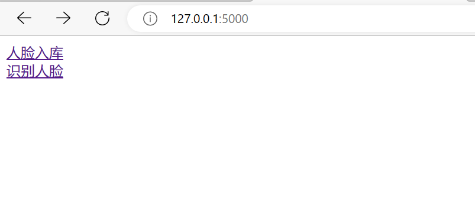
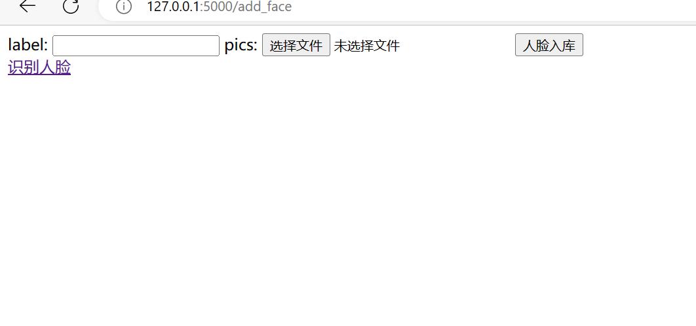
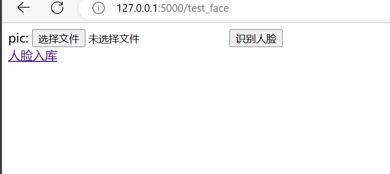

## 简介
基于人脸识别dlib库和Flask框架的人脸识别服务

对外提供：

数据量不大使用前三个接口（功能完整）：

1.批量特征入库接口（FACES_DIR中提前放入图片，批量提取特征重写库）

2.人脸录入接口（提取特征增量入库）

3.人脸识别接口（根据特征识别图片）

***


4.人脸特征提取接口

数据量大可以只使用该接口，工程端提取到特征值自行存储。

详细逻辑：

做人脸录入时：上传多张人脸图片提取特征均值使用ES存储（id->特征均值），id->人详细信息可以存入mysql

做人脸识别时：上传单张人脸照片提取特征值，利用ES相似度算法查询符合条件的id，再用id到mysql查询出对应人详细信息


## 如何启动


### 配置详解
config.py

```python
DLIB_FACE_RECOGNITION_DAT = ''#dlib人脸识别模型文件位置
SHAP_PREDICTOR_DAT = ''#人脸预测器模型文件位置
CSV = ''#人脸特征保存位置，提前创建好文件touch /xxx/xxx/face.csv
FACES_DIR = ''#人脸图片目录，提前建好
TMP_DIR = ''#人脸图片临时目录，提前建好
```
dlib人脸识别模型文件和人脸预测器模型文件可在网上下载

***
### 环境准备
python版本：3.8.10

1.建议先升级pip版本
```shell
python -m pip install --upgrade pip -i https://pypi.tuna.tsinghua.edu.cn/simple
```
2.安装创建虚拟环境插件
```shell
pip install virtualenv -i https://pypi.tuna.tsinghua.edu.cn/simple
```
3.进入项目目录下构建虚拟环境
```shell
virtualenv -p /usr/bin/python venv #如果有多个Python版本，私用-p python路径，否则不需要
```
4.激活虚拟环境
```shell
source ./venv/bin/activate
```
5.安装依赖
```shell
pip install -r  requirements.txt -i https://pypi.tuna.tsinghua.edu.cn/simple
```
6.安装dlib库

```shell
#linux下，提前安装好2.10.12以上版本的cmake，然后执行如下指令
pip install ./scripts/dlib-19.19.0.tar.gz
#windows下，直接执行如下指令
pip install ./scripts/dlib-19.19.0-cp38-cp38-win_amd64.whl.whl
```

***
### 运行
#### windows:
```shell
#刚准备好的虚拟环境下执行
python app.py
```
#### linux:

1.修改项目目录下的uwsgin_config.ini
```python
[uwsgi]
uid = root
gid = root

#工程名
project = face-recognizer
#工程父目录
base = /opt

http = 0.0.0.0:5000
callable = app
home = %(base)/%(project)/venv
chdir = %(base)/%(project)
wsgi-file = %(base)/face-recognizer/app.py

processes = 4
threads = 4
buffer-size = 32768
master = true

pidfile = %(base)/%(project)/%(project).pid
daemonize = %(base)/%(project)/%(project).log

vacuum = True

buffer-size = 65536
post-buffering = 65536

reload-mercy = 10
reload-on-as = 1024
```
base改成工程所在目录绝对路径即可

2.安装uwsgi
```shell
deactivate #退出虚拟环境

pip install uwsgi -i https://pypi.tuna.tsinghua.edu.cn/simple
```

3.执行
```shell
#项目根目录下执行
uwsgi --ini uwsgin_config.ini
```

4.如何结束应用
```shell
#项目根目录下执行
uwsgi --stop face-recognizer.pid
```

***

## 体验入口
访问 http://ip:port/





### 人脸录入页面

***

## SpringBoot 接入案例
共四个接口，具体使用请仔细阅读控制器中的注释

注意：如果大规模应用请使用 extractEigenvalue 接口提取特征自行存储

注意：如果图片过多 /faceRecognizer/initOnce接口调用人脸识别服务处理时间会较长，耐心等待会发现CSV中写入数据，调试过程中尽量不要打开CSV文件，以免被锁导致程序报错

1.控制器，根据注释针对业务自行调整
```java

import lombok.extern.slf4j.Slf4j;
import org.apache.commons.lang3.reflect.TypeUtils;
import org.springframework.beans.factory.annotation.Value;
import org.springframework.http.HttpMethod;
import org.springframework.web.bind.annotation.RequestMapping;
import org.springframework.web.bind.annotation.RequestMethod;
import org.springframework.web.bind.annotation.RequestParam;
import org.springframework.web.bind.annotation.RestController;
import org.springframework.web.multipart.MultipartFile;

import javax.annotation.PostConstruct;
import javax.annotation.PreDestroy;
import java.io.IOException;
import java.io.InputStream;
import java.util.*;
import java.util.concurrent.*;
import java.util.concurrent.atomic.AtomicInteger;


@RestController
@Slf4j
@RequestMapping("faceRecognizer")
public class FaceRecognizerController {

    @Value("${face_recognizer.http.ip:127.0.0.1}")
    private String faceRecognizerIp;

    @Value("${face_recognizer.http.port:5000}")
    private String faceRecognizerPort;

    private static CustomThreadPool INPUT_FACE_THREAD_POOL = null;

    /**
     * 配置为true后项目启动后可以调用一次人脸识别init接口
     */
    @Value("${face_recognizer.initOnce.enable:true}")
    private boolean faceRecognizerInitOnceEnable;

    private boolean isInitUsedFromApplicationOn = false;

    @PostConstruct
    public void init() {
        if (INPUT_FACE_THREAD_POOL == null) {
            INPUT_FACE_THREAD_POOL = new CustomThreadPool("inputFaceThread", 16);
        }
    }
    /**
     * 该接口会重新计算人脸识别服务对应图片目录吓所有图片，写特征入库
     * 建议在项目刚上线时，设置face_recognizer.initOnce.enable为true，在人脸识别服务对应FACES_DIR里面建文件夹，每个文件名作为identity，内部存入单个人得所有人脸图片
     * 上线完后更新迭代过程中建议设置face_recognizer.initOnce.enable为false，后用inputFace接口增量录入人脸
     */
    @RequestMapping(value = "/initOnce", method = RequestMethod.GET)
    public void initOnce() {
        String baseUrl = String.format("http://%s:%s", faceRecognizerIp, faceRecognizerPort);

        if (faceRecognizerInitOnceEnable && !isInitUsedFromApplicationOn) {
            INPUT_FACE_THREAD_POOL.executeTask(() -> {
                RequestUtil.doRequest(true, baseUrl + "/face/init", HttpMethod.GET, null, null, TypeUtils.parameterize(List.class, FaceCompareResult.class));

            });
            isInitUsedFromApplicationOn = true;
        }

    }
    /**
     * 人脸识别接口，传单张图片作识别
     */
    @RequestMapping(value = "/identify", method = RequestMethod.POST)
    public void identify(@RequestParam("pic") MultipartFile file) {
        byte[] byt;
        InputStream inputStream = null;
        try {
            byt = new byte[file.getInputStream().available()];
            inputStream = file.getInputStream();
            inputStream.read(byt);
            inputStream.close();
            String fileBase64 = Base64.getEncoder().encodeToString(byt);

            Map<String, String> data = new HashMap<>();
            data.put("pic", fileBase64);

            String baseUrl = String.format("http://%s:%s", faceRecognizerIp, faceRecognizerPort);

            ResponseWrapper responseWrapper = RequestUtil.doRequest(true, baseUrl + "/face/identify_base64", HttpMethod.POST, null, data, TypeUtils.parameterize(List.class, FaceCompareResult.class));

            List<FaceCompareResult> compareResults = (List<FaceCompareResult>) responseWrapper.getData();

            //如果上传的是单人脸照片，使用如下代码
            FaceCompareResult faceCompareResult = compareResults.get(0);
            log.info("人物标识", faceCompareResult.getLabel());
            log.info("任务匹配度", faceCompareResult.getScore());
            //拿到人物标识后做具体的业务

        } catch (Throwable t) {
            log.error("url:/faceRecognizer/identify,error:", t);
        } finally {
            try {
                inputStream.close();
            } catch (IOException e) {
            }
        }
    }

    /**
     * 人脸录入接口，前端传业务需要得标识信息和图片（可以多张，必须同一个人的人脸），接到标识信息自行生成唯一标识！！！
     */
    @RequestMapping(value = "/inputFace", method = RequestMethod.POST)
    public void inputFace(@RequestParam("pics") MultipartFile[] files, @RequestParam String identity) {

        List<String> picBase64List = new ArrayList<>();
        for (MultipartFile file : files) {
            byte[] byt;
            InputStream inputStream = null;
            try {
                byt = new byte[file.getInputStream().available()];
                inputStream = file.getInputStream();
                inputStream.read(byt);
                inputStream.close();
                String fileBase64 = Base64.getEncoder().encodeToString(byt);
                picBase64List.add(fileBase64);

            } catch (Throwable t) {
                log.error("url:/faceRecognizer/inputFace,error:", t);
            } finally {
                try {
                    inputStream.close();
                } catch (IOException e) {
                }
            }
        }
        Map<String, Object> data = new HashMap<>();

        //pics接收同一个人的多张人脸照片，照片多相对可以提高人脸识别准确率
        data.put("pics", picBase64List);

        //这里的简单处理了identity
        //建议inputFace接收更多的人的相关信息，业务方自建表存这些信息并生成唯一标识存入identity
        data.put("identity", identity);

        String baseUrl = String.format("http://%s:%s", faceRecognizerIp, faceRecognizerPort);

        //调用过程时间可能较长，这里异步处理，应用中使用酌情考虑
        INPUT_FACE_THREAD_POOL.executeTask(() -> {

            RequestUtil.doRequest(true, baseUrl + "/face/add_face_base64", HttpMethod.POST, null, data, String.class);

        });


    }

    /**
     * 人脸特征提取
     */
    @RequestMapping(value = "/extractEigenvalue", method = RequestMethod.POST)
    public void extractEigenvalue(@RequestParam("pics") MultipartFile[] files) {

        List<String> picBase64List = new ArrayList<>();
        for (MultipartFile file : files) {
            byte[] byt;
            InputStream inputStream = null;
            try {
                byt = new byte[file.getInputStream().available()];
                inputStream = file.getInputStream();
                inputStream.read(byt);
                inputStream.close();
                String fileBase64 = Base64.getEncoder().encodeToString(byt);
                picBase64List.add(fileBase64);

            } catch (Throwable t) {
                log.error("url:/faceRecognizer/inputFace,error:", t);
            } finally {
                try {
                    inputStream.close();
                } catch (IOException e) {
                }
            }
        }
        Map<String, Object> data = new HashMap<>();

        data.put("pics", picBase64List);


        String baseUrl = String.format("http://%s:%s", faceRecognizerIp, faceRecognizerPort);

        ResponseWrapper<List<Double>> responseWrapper = RequestUtil.doRequest(true, baseUrl + "/face/extractEigenvalue",
                HttpMethod.POST, null, data, TypeUtils.parameterize(List.class, Double.class));

        List<Double> data1 = responseWrapper.getData();
        //拿到特征值数组后自行存储

    }
    public static class CustomThreadPool {
        private ExecutorService executorService;

        public CustomThreadPool(String threadNamePrefix, int poolSize) {
            ThreadFactory threadFactory = new ThreadFactory() {
                private AtomicInteger threadCount = new AtomicInteger(0);

                public Thread newThread(Runnable r) {
                    if (threadCount.incrementAndGet() == Integer.MAX_VALUE) {
                        threadCount.set(0);
                    }
                    Thread t = new Thread(r, threadNamePrefix + "-" + threadCount.get());
                    return t;
                }
            };

            this.executorService = Executors.newFixedThreadPool(poolSize, threadFactory);
        }

        public void submitTask(Callable task) {
            executorService.submit(task);
        }

        public void executeTask(Runnable task) {
            executorService.execute(task);
        }

        public void shutdown() {
            try {
                executorService.shutdown();
                executorService.awaitTermination(5, TimeUnit.SECONDS);
            } catch (InterruptedException e) {
            } finally {
                executorService.shutdownNow();
            }
        }
    }

    @PreDestroy
    public void destroy() {
        if (INPUT_FACE_THREAD_POOL != null) {
            INPUT_FACE_THREAD_POOL.shutdown();
        }
    }
}
```

2.请求工具,上述控制器使用了该类
```java

import cn.hutool.core.bean.BeanUtil;
import cn.hutool.extra.spring.SpringUtil;
import com.fasterxml.jackson.databind.DeserializationFeature;
import com.fasterxml.jackson.databind.ObjectMapper;

import lombok.extern.slf4j.Slf4j;
import org.apache.commons.lang3.reflect.TypeUtils;
import org.apache.http.Header;
import org.apache.http.client.HttpClient;
import org.apache.http.client.config.RequestConfig;
import org.apache.http.config.Registry;
import org.apache.http.config.RegistryBuilder;
import org.apache.http.conn.socket.ConnectionSocketFactory;
import org.apache.http.conn.socket.PlainConnectionSocketFactory;
import org.apache.http.conn.ssl.SSLConnectionSocketFactory;
import org.apache.http.impl.client.DefaultConnectionKeepAliveStrategy;
import org.apache.http.impl.client.DefaultHttpRequestRetryHandler;
import org.apache.http.impl.client.HttpClientBuilder;
import org.apache.http.impl.conn.PoolingHttpClientConnectionManager;
import org.apache.http.message.BasicHeader;
import org.springframework.core.ParameterizedTypeReference;
import org.springframework.http.*;
import org.springframework.http.client.ClientHttpRequestFactory;
import org.springframework.http.client.HttpComponentsClientHttpRequestFactory;
import org.springframework.util.LinkedMultiValueMap;
import org.springframework.util.MultiValueMap;
import org.springframework.web.client.RestTemplate;

import java.lang.reflect.Type;
import java.util.*;


@Slf4j
public class RequestUtil {


    private static volatile ObjectMapper mapper;

    private static RestTemplate restTemplate;

    private static final Integer MAX_TOTAL = 100;

    private static final Integer DEFAULT_MAX_PER_ROUTE = 100;

    private static final Integer CONNECT_TIMEOUT = 40000;

    private static final Integer connectionRequestTimeout = 60000;

    private static final Integer SOCKET_TIMEOUT = 30000;

    private static final Boolean STALE_CONNECTION_CHECK_ENABLED = true;


    private static final Integer VALIDATE_AFTER_INACTIVITY = 3000000;

    public static <T> ResponseWrapper doRequest(Boolean isJsonElseForm, String httpUrl, HttpMethod httpMethod, Object headers, Object params, Class<T> clazz) {
        HttpEntity<?> httpEntity = genHttpEntity(isJsonElseForm, headers, params);


        final RestTemplate restTemplate = getRestTemplate();
        ResponseEntity<ResponseWrapper> responseEntity = restTemplate.exchange(httpUrl, httpMethod, httpEntity, new ParameterizedTypeReference<>() {
            public Type getType() {

                return TypeUtils.parameterize(ResponseWrapper.class, clazz);
            }
        }, new HashMap<>());


        return responseEntity.getBody();
    }


    public static ResponseWrapper doRequest(Boolean isJsonElseForm, String httpUrl, HttpMethod httpMethod, Object headers, Object params, Type type) {
        HttpEntity<?> httpEntity = genHttpEntity(isJsonElseForm, headers, params);


        final RestTemplate restTemplate = getRestTemplate();
        ResponseEntity<ResponseWrapper> responseEntity = restTemplate.exchange(httpUrl, httpMethod, httpEntity, new ParameterizedTypeReference<>() {
            public Type getType() {

                return TypeUtils.parameterize(ResponseWrapper.class, type);
            }
        }, new HashMap<>());


        return responseEntity.getBody();
    }


    private static HttpEntity<?> genHttpEntity(Boolean isJsonElseForm, Object headers, Object params) {
        HttpHeaders httpHeaders = new HttpHeaders();
        Map<String, Object> headerMap = BeanUtil.beanToMap(headers);

        if (headerMap != null) {
            headerMap.forEach((key, value) -> {
                if (key instanceof String) {
                    httpHeaders.add(key, (String) value);
                }
            });
        }
        if (isJsonElseForm) {
            httpHeaders.setContentType(MediaType.parseMediaType("application/json; charset=UTF-8"));
        } else {
            httpHeaders.setContentType(MediaType.parseMediaType("multipart/form-data; charset=UTF-8"));
        }

        HttpEntity<?> httpEntity;
        if (isJsonElseForm) {
            httpEntity = new HttpEntity<>(params, httpHeaders);
        } else {
            MultiValueMap<String, Object> map;

            if (params != null) {
                map = new LinkedMultiValueMap<>();
                Map<String, Object> paramsMap = BeanUtil.beanToMap(params);
                paramsMap.forEach(map::add);
            } else {
                map = null;
            }
            httpEntity = new HttpEntity<>(map, httpHeaders);
        }
        return httpEntity;
    }


    private static RestTemplate getRestTemplate() {
        if (restTemplate == null) {
            synchronized (RequestUtil.class) {
                if (restTemplate == null) {
                    restTemplate = createRestTemplate();
                }
            }
        }
        return restTemplate;
    }

    private static ObjectMapper getObjectMapper() {

        try {
            ObjectMapper objectMapper = SpringUtil.getBean(ObjectMapper.class);
            if (objectMapper != null) {
                return objectMapper;
            }
        } catch (Exception e) {
        }

        if (mapper == null) {
            synchronized (RequestUtil.class) {
                if (mapper == null) {
                    mapper = new ObjectMapper();
                    mapper.configure(DeserializationFeature.FAIL_ON_UNKNOWN_PROPERTIES, false);
                }
            }
        }
        return mapper;
    }


    private static RestTemplate createRestTemplate() {
        return new RestTemplate(createHttpRequestFactory());
    }

    private static ClientHttpRequestFactory createHttpRequestFactory() {
        return new HttpComponentsClientHttpRequestFactory(createHttpClient());
    }

    private static HttpClient createHttpClient() {
        Registry<ConnectionSocketFactory> registry = RegistryBuilder.<ConnectionSocketFactory>create().register("http", PlainConnectionSocketFactory.getSocketFactory()).register("https", SSLConnectionSocketFactory.getSocketFactory()).build();

        /**
         * 创建连接池
         */
        PoolingHttpClientConnectionManager connectionManager = new PoolingHttpClientConnectionManager(registry);
        connectionManager.setMaxTotal(MAX_TOTAL); // 最大连接数
        connectionManager.setDefaultMaxPerRoute(DEFAULT_MAX_PER_ROUTE);    //单个路由最大连接数
        connectionManager.setValidateAfterInactivity(VALIDATE_AFTER_INACTIVITY); // 最大空间时间
        RequestConfig requestConfig = RequestConfig.custom().setSocketTimeout(SOCKET_TIMEOUT)        //服务器返回数据(response)的时间，超过抛出read timeout
                .setConnectTimeout(CONNECT_TIMEOUT)      //连接上服务器(握手成功)的时间，超出抛出connect timeout
                .setStaleConnectionCheckEnabled(STALE_CONNECTION_CHECK_ENABLED) // 提交前检测是否可用
                .setConnectionRequestTimeout(connectionRequestTimeout)//从连接池中获取连接的超时时间，超时间未拿到可用连接，会抛出org.apache.http.conn.ConnectionPoolTimeoutException: Timeout waiting for connection from pool
                .build();

        //headers
        List<Header> headers = new ArrayList<>();
        headers.add(new BasicHeader("User-Agent", "Mozilla/5.0 (Windows NT 6.1) AppleWebKit/537.36 (KHTML, like Gecko) Chrome/31.0.1650.16 Safari/537.36"));
        headers.add(new BasicHeader("Accept-Encoding", "gzip,deflate"));
        headers.add(new BasicHeader("Accept-Language", "zh-CN"));
        headers.add(new BasicHeader("Connection", "Keep-Alive"));
        headers.add(new BasicHeader("Content-type", "application/json;charset=UTF-8"));

        return HttpClientBuilder.create().setDefaultRequestConfig(requestConfig).setConnectionManager(connectionManager).setDefaultHeaders(headers)
                // 保持长连接配置，需要在头添加Keep-Alive
                .setKeepAliveStrategy(new DefaultConnectionKeepAliveStrategy())
                //重试次数，默认是3次，没有开启
                .setRetryHandler(new DefaultHttpRequestRetryHandler(2, true)).build();
    }
}
```
3.响应类（控制器和请求工具导入下面两个类）
```java

import lombok.AllArgsConstructor;
import lombok.Getter;
import lombok.NoArgsConstructor;
import lombok.Setter;

@AllArgsConstructor
@NoArgsConstructor
@Getter
@Setter
public class ResponseWrapper<T> {

    private String message;

    private Integer code;

    private T data;


}

```

```java
package com.telit.upms.utils.response;

import lombok.Data;

@Data
public class FaceCompareResult {

    String label;

    String score;


}

```
